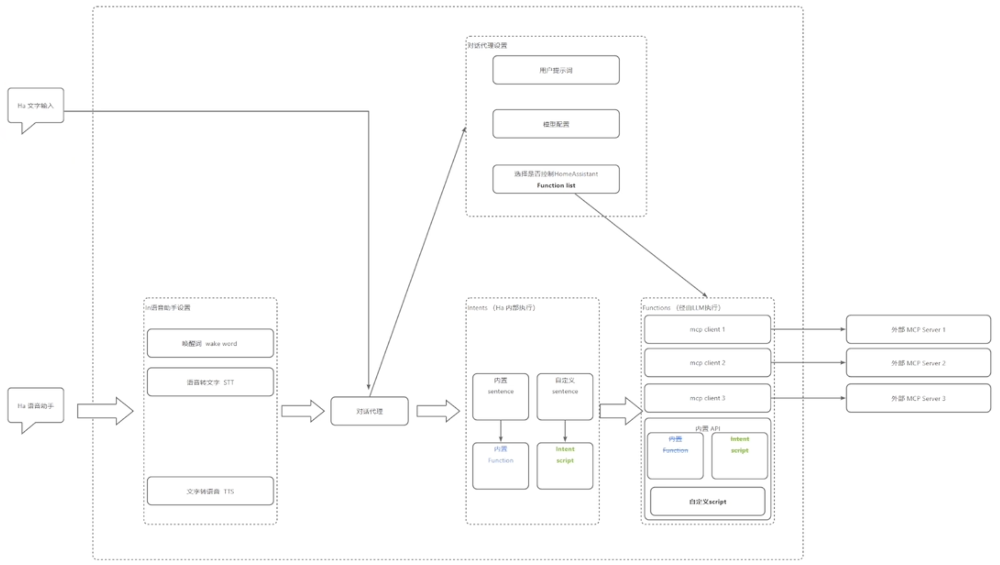

# 簡介
Home Assistant 作為一個全能的開源智慧家庭平台，它也內建了 MCP 能力，可以分別扮演 2 種角色：
| 角色 | 說明 |
| --- | ---- |
| **MCP server** | 將 Home Assistant 中的**設備控制功能（如燈光、空調、感測器）作為 MCP 接口**，供外部大模型使用。 |
| **MCP client**| **接入外部 MCP Server**，結合 HA 裡已接入的 LLM，進一步增強 HA 本身作為「大模型 Agent」時的能力 |

### HA 作為 MCP client
Home Assistant 內建**語音助理**的工作邏輯（自己是 Agent 接取 LLM + MCP server）

### HA 作為 MCP server
Home Assistant 原生透過 SSE （Server-Sent Events）協定暴露 MCP Server，這樣就可以存取 Home Assistant 所有已經整合的外部 MCP Server，像使用自己的「能力庫」一樣呼叫它們，無需重複開發。

- **伺服器發送事件 (SSE, Server-Sent Events)**
  - SSE 是一種 Web 技術，允許伺服器向客戶端(通常是瀏覽器) 推送即時更新。
  - SSE 使用 HTTP 協議，**伺服器只需開啟一個 HTTP 連接，然後持續向客戶端傳送數據，而不需要客戶端不斷輪詢**。
  - SSE 適用於各種需要即時資料推播的場景，例如股票行情更新、社群媒體通知等。
  - 與 WebSocket 相比，SSE 更加簡單易用，但它是**單向通信**，只能由伺服器向客戶端推送資料。

### HA 的腳本
- HA 的腳本其實就是一個**自訂 function** 的大殺器。
- 一句話的描述就是可以**透過 `fields` 給腳本傳遞參數，同時根據你的描述訊息，HA 也會自動將你的腳本轉換成一個 function 給 LLM**。
  - https://www.home-assistant.io/integrations/script/#fields
  - https://www.home-assistant.io/integrations/script/#passing-variables-to-scripts

